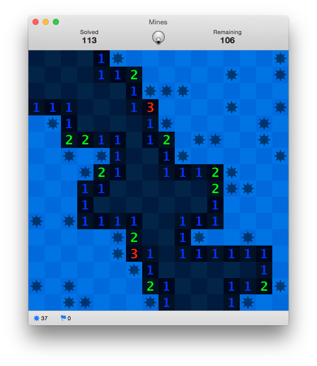

# Mines
A Minesweeper Game for OS X.  
Copyright © 2013-2014 Manuel Sainz de Baranda y Goñi.  
Released under the terms of the [GNU General Public License v3](http://www.gnu.org/copyleft/gpl.html).

### What is Mines?
Mines is a simple and elegant implementation of the classic game [Minesweeper](http://en.wikipedia.org/wiki/Minesweeper_(video_game)). The purpose of the game is to find all the mines on the board by uncovering all the empty cells. You can use flags to mark the cells suspected of containing a mine to avoid an accidental detonation.

### Features
* Predefined and custom board settings.
* Save and load games.
* Resume last unfinished game on launch (enabled by default).
* The first click always opens a clean area.
* You can cheat shooting a laser beam to uncover the next empty cell.
* Optional animations and sounds (enabled by default).
* Smooth graphics: Vector drawing using OpenGL.
* Window can be resized at any time maintaining an approximated (default) or exact aspect ratio.
* Fully customizable appearance: You can change font, colors, and images (you can use your own images too).
* It includes a set of predefined themes.

### Controls
* Uncover Cell: `Mouse Left`
* Toggle Flag: `Mouse Right` or `Shift` + `Mouse Left`

### Notes
* In order to compile, you need to install the [Q API](http://github.com/redcode/Q) in "/usr/local/include/Q".
* It is guaranteed to run correctly in OS X 10.6 or above, although compatibility with OS X 10.5 (Intel or PowerPC) should not be difficult to achieve.

### Want to help?
Buy it on the [Mac App Store](https://itunes.apple.com/us/app/mines/id602009455)!  
  
If you want to improve the game or add any feature, your code is welcome.
Alternatively you can make a small donation to support the development of this software.

CURRENCY|ADDRESS
:---:|:---:
[Bitcoin](https://bitcoin.org)|`16Nu1Smx6Dymj9onnWmehPkACqs6xF3Bj4`
[Litecoin](https://litecoin.org)|`LM31aXyh2nNJDNWF7j2Ds8QNemuP8eUHuN`
[DogeCoin](http://dogecoin.com)|`DMpowbgKbgUbU73ABW9NwaVkvcc4fG5bUc`
[MaxCoin](http://www.maxcoin.co.uk)|`mSk8Ji1K6YBqfrKHk1uMsjpnjx91hcCDwR`

### History

* __v2.2__ _(Under development)_
    * WIP: Added time counter for games without time limit.
    * WIP: Double-click technique support.
    * WIP: Improved font rendering.

* __[v2.1](http://github.com/redcode/Mines/releases/tag/v2.1)__ _(2014-12-21)_
    * UI fixes for Snow Leopard.
    * Fixed a bug related to the font selection dialog.
    * Improved default theme.
    * Several minor improvements and bug fixes.

* __[v2.0](http://github.com/redcode/Mines/releases/tag/v2.0)__ _(2014-11-05)_
    * Yosemite support.
    * Retina Display support.
    * Russian language support.
    * New theme editor: Now you can have several themes at a time.
    * Added a set of predefined themes.
    * Improved default theme.
    * Improved animations.
    * Resolved a bug which prevented the correct displaying of some animations in Mavericks and Yosemite.
    * Resolved a bug which caused incorrect font rendering in the "Game Over" message.
    * Minor UI tweaks.
    * Mines is now Free Software instead of Freeware (but subject to Apple's Standard License Agreement if purchased in the Mac App Store).
    * Added a link to the source code in the "About Mines" window.

* __v1.3.1__ _(2013-06-20)_
    * Because popular request, the values of the typical games have been changed.
    * Added alert for Retina Display.

* __v1.3__ _(2013-06-09)_
    * Less memory usage.
    * Better random field generation.
    * Laser cannon behaviour has been changed to uncover an area, instead a sole cell, if it is used when the board is untouched yet.
    * Mouse drag behaviour has been changed to allow to discover cells or place flags if the button is released over the same cell where it was pressed initially (Thanks to Młody Pajac for the advice. The "reveal remaining cells" feature you request will be implemented in the next version).
    * Flags can not be placed before disclosing the first cell any more.
    * OpenAL is used now instead Cocoa to play sounds without any lag.
    * Minor aesthetic improvements and bug fixes.

* __v1.2__ _(2013-05-26)_
    * Mines is FREE (as in Freedom). NOW and FOREVER! 
    * Better Snow Leopard compatibility.

* __v1.1__ _(2013-04-27)_
    * Partial support for French, German, Portuguese and Swedish.
    * Added support for placing flags pressing SHIFT or by enabling the flag indicator in the status bar.

* __v1.0__ _(2013-02-12)_
    * Initial release.
